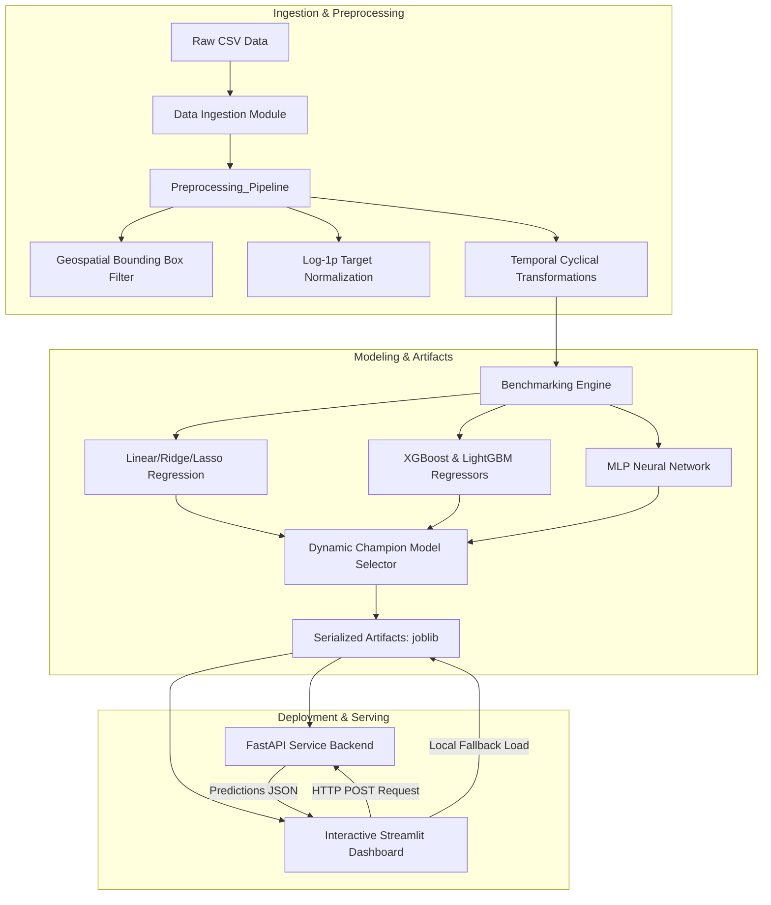

# NYC Taxi Trip Duration Prediction (End-to-End ML Pipeline)

[](https://marwan-amin-nyc-trip-duration.streamlit.app/)


## 🚀 1. Executive Summary & Live Demo

This repository contains a production-grade, end-to-end Machine Learning engineering pipeline designed to predict taxi trip durations in New York City. Operating under real-time transportation constraints, the system models logistical telemetry data—converting raw spatial coordinate pick-ups/drop-offs and temporal timestamps into highly accurate trip duration estimates. This pipeline serves as a foundational component for real-time ETA estimation, dispatch optimization, and logistics scheduling.

### 🔗 Live Demo
The application is fully deployed and accessible via the following link:
**👉 [NYC Taxi Trip Duration Predictor Dashboard](https://marwan-amin-nyc-trip-duration.streamlit.app/)**

### 📊 Key Performance Metrics
* **Champion Model:** Multi-layer Perceptron (MLP) Neural Network (`run_id: d399dc13`) trained on the full dataset of **992,562** records.
* **Average Absolute Error (MAE):** **~3.16 minutes** (3m 09s / 189.6 seconds) on the validation split.
* **Validation Root Mean Squared Error (RMSE):** **0.4348** (evaluated in log-transformed space $\log(1+y)$).
* **Validation Coefficient of Determination ($R^2$ Score):** **0.7042**, explaining over 70.4% of trip duration variance out-of-sample.

---

## 🏗️ 2. End-to-End System Architecture

The project features a highly decoupled, modular structure separating ingestion, preprocessing, training, serving, and interface concerns. Below is the system data and deployment flow:

```
                                 [ RAW DATA ]
                           (NYC Taxi Trip CSV Data)
                                      │
                                      ▼
                       [ PREPROCESSING & CLEANING ]
                    - Spatial bounding box validation
                    - Outlier trip duration truncation
                    - Logarithmic target stabilization
                                      │
                                      ▼
                      [ FEATURE ENGINEERING PIPELINE ]
                    - Distance metrics (Manhattan & Euclidean)
                    - Trigonometric cyclical temporal transformations
                    - Season encoding & weekend classification
                                      │
                                      ▼
                       [ MODEL TRAINING & BENCHMARK ]
                    - Multi-model evaluation (6 Algorithms)
                    - Early stopping & hyperparameter tuning
                                      │
                                      ▼
                    [ AUTOMATED MODEL EVAL & SELECTION ]
                 Dynamic selection based on Val RMSE + Overfit Gap
                                      │
                                      ▼
                      [ ARTIFACT SERIALIZATION (.joblib) ]
                         Preprocessor & Champion Model
                               /            \
                              /              \
                             ▼                ▼
                     [ FASTAPI REST API ]  [ STREAMLIT WEB APP ]
                      (Port: 8000)          (Port: 8501 / Streamlit Cloud)
                             ▲                │
                             └──────HTTP──────┘
                              (REST Ingestion &
                              Local Fallback Engine)
```

### End-to-End Flow Diagram (Mermaid.js)



---

## 🔍 3. Exploratory Data Analysis (EDA) & Domain Problem-Solving

Transportation datasets pose unique real-world anomalies that must be addressed to ensure model generalization. The pipeline implements domain-specific solutions for the following challenges:

### I. Geospatial Outliers Filtering
Raw telemetry records occasionally register coordinate signals far outside the metropolitan area (due to GPS sensor malfunctions or dropped signals). The pipeline implements strict bounding box thresholds corresponding to the municipal borders of New York City:
* **Latitude Range:** $[40.5, 41.0]$
* **Longitude Range:** $[-74.25, -73.5]$
Any coordinates outside this bounding polygon are pruned, eliminating false inputs (e.g., coordinates mapping to coordinates in the Atlantic Ocean or other states).

### II. Trip Duration Skewness Stabilization
The raw target variable `trip_duration` (seconds) displays extreme right-skewness (caused by anomalous events like multi-day rentals, coordinate errors, or severe gridlock). To stabilize target variance, the pipeline performs:
1. **Duration Truncation:** Drops trips under 60 seconds (1 minute) and over 7,000 seconds (~1.94 hours) during training.
2. **Log-Transformation:** Applies a log-transformation to stabilize the variance:
   $$y_{\text{trans}} = \log(1 + y)$$
This keeps model weights from being dominated by extreme values. The final inference returns predictions in original units using the exponential inverse:
   $$y_{\text{pred}} = \exp(y_{\text{log\_pred}}) - 1$$

### III. Feature Engineering
* **Manhattan Distance:** Models NYC's urban grid block structure:
  $$d_{\text{Manhattan}} = |lat_{\text{drop}} - lat_{\text{pick}}| + |lon_{\text{drop}} - lon_{\text{pick}}|$$
* **Euclidean Distance:** Calculates straight-line spatial displacement:
  $$d_{\text{Euclidean}} = \sqrt{(lat_{\text{drop}} - lat_{\text{pick}})^2 + (lon_{\text{drop}} - lon_{\text{pick}})^2}$$
* **Haversine Distance:** Used during EDA to capture great-circle spherical distance over the Earth's surface.
* **PCA Coordinate Rotation:** Principal Component Analysis is applied to pickup/dropoff coordinates in EDA to rotationally align spatial vectors with Manhattan's actual street grid orientation (slanted approximately $29^\circ$ northeast).
* **Cyclical Temporal Features:** Ordinal time divisions (hours, days of the week, months) are continuous loops (e.g., hour 23 is geographically adjacent to hour 0). Mapping them linearly fails to capture this relationship. We apply trigonometric sine and cosine transformations to preserve temporal continuity:
  $$x_{\sin} = \sin\left(\frac{2 \pi \cdot x}{X_{\max}}\right), \quad x_{\cos} = \cos\left(\frac{2 \pi \cdot x}{X_{\max}}\right)$$
  *(where $X_{\max}$ represents 24.0 for hours, 7.0 for day of the week, and 12.0 for months).*
* **Categorical Temporal Flags:** Feature generation includes `is_weekend` (isolating weekly rest schedules) and `season` labels (mapping seasonal weather shifts).

---

## 🤖 4. Modeling Strategy & Production Engineering

### Multi-Model Benchmarking
The benchmarking suite evaluates six distinct algorithms under matching pipeline configurations to locate the optimal performer:
1. **Ordinary Least Squares (OLS) Linear Regression**
2. **Ridge Regression:** ($L_2$ regularization, $\alpha = 10.0$)
3. **Lasso Regression:** ($L_1$ regularization, $\alpha = 0.01$, max\_iter $= 2000$)
4. **XGBoost Regressor:** (n\_estimators $= 600$, max\_depth $= 7$, learning\_rate $= 0.03$)
5. **LightGBM Regressor:** (n\_estimators $= 800$, max\_depth $= 8$, num\_leaves $= 63$, learning\_rate $= 0.03$)
6. **Neural Network (MLP Regressor):** (hidden\_layer\_sizes $= [128, 64, 32]$, solver $=$ `adam`, learning\_rate\_init $= 0.002$, early\_stopping $=$ `True`)

### Production Best Practices

* **Strict Data Leakage Prevention:** Preprocessing steps (e.g., fitting the `LabelEncoder`, `RobustScaler`, and `PolynomialFeatures`) are executed *strictly* on training partitions. Parameters are locked inside the pipeline instance and applied out-of-sample to validation and testing datasets.
* **Robust Scaling:** Rather than standard scaling (which is sensitive to outliers), the pipeline uses `RobustScaler` to scale columns based on interquartile ranges (IQR):
  $$x_{\text{scaled}} = \frac{x - \text{median}(x)}{\text{IQR}(x)}$$
* **Automated Selection & Deployment:** The `select_best_model.py` module evaluates validation runs using a balance score designed to penalize overfitting:
  $$\text{Score} = \text{Val RMSE} + w \cdot |\text{Val RMSE} - \text{Train RMSE}| \quad (\text{where } w = 0.5)$$
The champion model is dynamically copied to `best_model.joblib` for seamless API hot-swapping.
* **Artifact Portability:** Serialization is managed using `joblib`, packaging preprocessing structures alongside model weights for easy deployment.

---

## 🛠️ 5. Project Architecture & Software Engineering Standards

The codebase implements professional software engineering patterns including modularity, dynamic path resolution, explicit type checking, and config-driven parameters.

### Directory Structure
```
.
├── app.py                     # Streamlit Frontend Web App Dashboard
├── main.py                    # FastAPI Backend REST API Application
├── requirements.txt           # Python Project Dependencies
├── Config/
│   ├── __init__.py            # Config package initializer
│   ├── config.yaml            # Main configuration parameters
│   └── load.py                # Configuration loader utility
├── Enum/
│   ├── __init__.py            # Enum package initializer
│   ├── Feature.py             # Feature name enum definitions
│   └── path_enums.py          # Data tier and file name enums
├── Preprocessing/
│   ├── __init__.py            # Preprocessing package initializer
│   └── preprocessing.py       # Modular OOP Preprocessing Pipeline
├── Modeling/
│   ├── __init__.py            # Modeling package initializer
│   ├── select_best_model.py   # Automated champion model publisher
│   ├── Saved_Models/          # Directory containing serialized model artifacts
│   │   ├── best_model.joblib  # Active champion model
│   │   ├── best_model_meta.json # Selection metadata
│   │   ├── lasso_model.joblib
│   │   ├── lightgbm_model.joblib
│   │   ├── linearRegression_model.joblib
│   │   ├── neuralNetwork_model.joblib
│   │   ├── preprocessor.joblib # Serialized preprocessor pipeline
│   │   ├── ridge_model.joblib
│   │   └── xgboost_model.joblib
│   ├── Helper/
│   │   ├── __init__.py        # Helper package initializer
│   │   ├── evaluate.py        # Model evaluation helper
│   │   ├── prepare.py         # Data split loader & processing helper
│   │   └── save.py            # Artifact persistence helper
│   └── Train/
│       ├── __init__.py        # Training package initializer
│       ├── lasso.py           # Lasso training script
│       ├── lightGBM.py        # LightGBM training script
│       ├── linear.py          # Linear Regression training script
│       ├── neural_network.py  # Neural Network training script
│       ├── ridge.py           # Ridge training script
│       └── xgBoost.py         # XGBoost training script
├── data/
│   ├── __init__.py            # Data package initializer
│   ├── load_data.py           # Ingestion and split loading utility
│   ├── split/                 # Full dataset splits (1M samples)
│   └── split_sample/          # Light sample splits for fast prototyping
├── notebooks/
│   └── eda.ipynb              # Exploratory Data Analysis notebook
├── Log/
│   ├── __init__.py            # Log package initializer
│   ├── apply_log.py           # Model logging utility
│   └── results/               # Experiment logs and summaries
│       ├── experiments.log
│       ├── experiments_summary.csv # Automated benchmarking metadata database
│       └── runs/              # JSON logs for individual training runs
└── Tests/
    ├── __init__.py            # Tests package initializer
    ├── test_data.py           # Tests for data loading and splits
    ├── test_helpers.py        # Tests for model helpers (eval/save)
    └── test_preprocessing.py  # Tests for cleaning and distance formulas
```

### Engineering Best Practices Adhered To
* **Single Responsibility Principle (SRP):** Outlier removal, spatial transformation, model training, and metrics calculations are isolated into dedicated classes and modules.
* **Open/Closed Principle:** Model architectures can be added under `Modeling/Train/` without modifying the core preprocessing or ingestion files.
* **Config-Driven Operations:** All hyperparameters, active columns, scaler selections, and saving directories are parameterized in `Config/config.yaml`.
* **Explicit Enums:** Prevents errors from string typing when referencing column keys (`Feature`) or files (`DataTier`).

---

## ⚡ 6. API & Dashboard Deployment (FastAPI + Streamlit)

The prediction system is wrapped in a production serving architecture featuring a FastAPI REST API backend and a Streamlit frontend web dashboard.

### FastAPI serving Backend
* **Pydantic Validation:** The `/predict` endpoint receives payloads validated via `TripRequest` schemas, ensuring data types and boundary constraints (e.g., passenger counts between 1 and 9) are enforced.
* **Health Monitoring:** A dedicated `/health` endpoint checks that the model and preprocessing artifacts are correctly loaded in memory.
* **Out-of-Bounds Exception Handling:** If input coordinates fall outside the bounds of NYC, the preprocessing pipeline filters them. FastAPI catches this and returns a structured `400 Bad Request` explaining the issue.

### Streamlit Interactive Dashboard
* **Sleek UX UI:** Features custom CSS with dark mode accents and Taxi Yellow styling.
* **Interactive Single Mode:** Allows users to input customized trip variables or click dynamic presets (e.g., *JFK Airport to Empire State Building*) to view instant predictions.
* **Visual Map Previews:** Renders pickup and dropoff points instantly on an interactive NYC map.
* **Dual Prediction Pipeline:** Streamlit attempts to process predictions via HTTP requests to the FastAPI backend. If the API is offline, it falls back to local model loading via `joblib`, ensuring high availability.
* **Bulk Processing Engine:** Supports uploading CSV and Excel files. Validates column headers, handles missing values with sensible defaults, runs batch predictions, and provides metrics such as average ride duration.
* **Exporting Capabilities:** Provides direct downloads of predictions as CSV or Excel sheets (using the `openpyxl` engine).

---

## 🧪 7. Quality Assurance & Continuous Integration

To ensure pipeline stability and coordinate math accuracy, a suite of unit tests is managed using `pytest`.

### Test Coverage Details
1. **`test_preprocessing.py`:**
   * `test_clean_data_outlier_filtering`: Confirms that coordinate points outside NYC boundaries are correctly filtered and dropped.
   * `test_geospatial_features_calculation`: Validates distance calculations against hand-calculated values (Manhattan $= 0.7$, Euclidean $= 0.5$).
   * `test_temporal_features_extraction`: Asserts correct day-of-week extraction and holiday/weekend detection.
2. **`test_helpers.py`:**
   * `test_save_and_load_object`: Confirms that model parameters written to disk match the parameters loaded back in.
   * `test_eval_model_output`: Evaluates metric equations (RMSE, $R^2$) using a simulated zero-error model.
3. **`test_data.py`:**
   * `test_get_data_path_all_combinations`: Confirms absolute directory mapping matches across tiers.
   * `test_load_train_val_test_all_tiers`: Verifies that training, validation, and testing sets load correctly without missing data.

---

## 🌿 8. Branching Strategy & Git Workflow

Development follows a strict, production-oriented branching model to keep the main branch stable:

```
                  [ main (Production Stable) ]
                               │
                ┌──────────────┴──────────────┐
                │                             │
    [ feature/fastapi-backend ]     [ feature/model-benchmarks ]
                │                             │
       - Add FastAPI endpoints        - Tune LightGBM & NN
       - Add Pydantic validation      - Run automated evaluations
                │                             │
                └──────────────┬──────────────┘
                               ▼
                        [ Pull Request ]
                 - Code Review & Lint Checks
                 - Automated pytest execution
                               │
                               ▼
                  [ Merged into main ]
```

### Git Commit Guidelines
Commits follow standard prefix formats to document changes clearly:
* `feat:` for new capabilities (e.g., `feat: integrate robust scaling option`).
* `fix:` for bugs (e.g., `fix: catch out of bounds coordinates error`).
* `test:` for QA additions (e.g., `test: add unit tests for distance formulas`).
* `docs:` for documentation (e.g., `docs: generate comprehensive README`).

---

## ⚙️ 9. Local Setup & Reproduction Guide

Follow these steps to run the pipeline, run the tests, and launch the services locally.

### Prerequisites
* **Python Version:** `Python 3.11`
* **Operating System:** Linux / macOS / Windows

### Setup Instructions

1. **Clone the Repository:**
   ```bash
   git clone https://github.com/MarwanIbrahimAmin/NYC-trip-duration.git
   cd NYC-trip-duration
   ```

2. **Initialize the Virtual Environment:**
   ```bash
   python3.11 -m venv venv
   source venv/bin/activate
   ```
   *(On Windows use: `venv\Scripts\activate`)*

3. **Install Dependencies:**
   ```bash
   pip install --upgrade pip
   pip install -r requirements.txt
   ```

4. **Execute the Test Suite:**
   Ensure all units pass before starting the services:
   ```bash
   pytest
   ```

5. **Start the FastAPI REST Server:**
   Launch the backend server locally:
   ```bash
   python main.py
   ```
   The API will launch at `http://127.0.0.1:8000`. You can inspect endpoints and run predictions directly via the interactive Swagger docs at `http://127.0.0.1:8000/docs`.

6. **Launch the Streamlit UI Dashboard:**
   In a new terminal window (with the virtual environment activated), start the front-end application:
   ```bash
   streamlit run app.py
   ```
   The interactive dashboard will open automatically in your browser at `http://localhost:8501`.